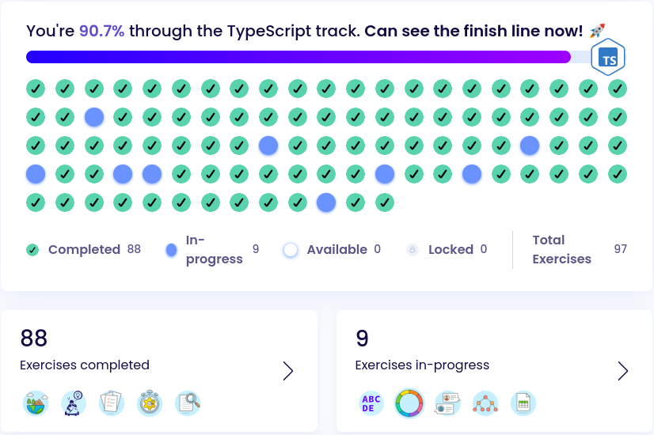

# TypeScript Track on Exercism

## Progress

## About

This repository contains my solutions to the exercises from the [Exercism
TypeScript track](https://exercism.io/tracks/typescript). TypeScript is a
superset of JavaScript, and it's taking the web development to the next level.
It's a statically typed language that compiles to plain JavaScript. It's a great
tool for building large applications.

## Exercises

Here's the complete list of exercises from the TypeScript track:

    Exercises

\# | Exercise | Status | Solution
:--|---------|:--------| :-------:
 1 | [Hello World](https://exercism.org/tracks/typescript/exercises/hello-world) | :white_check_mark: | [TS](./src/hello-world/hello-world.ts)
 2 | [Two Fer](https://exercism.org/tracks/typescript/exercises/two-fer) | :white_check_mark: | [TS](./src/two-fer/two-fer.ts)
 3 | [Resistor Color](https://exercism.org/tracks/typescript/exercises/resistor-color) | :white_check_mark: | [TS](./src/resistor-color/resistor-color.ts)
 4 | [Resistor Color Duo](https://exercism.org/tracks/typescript/exercises/resistor-color-duo) | :white_check_mark: | [TS](./src/resistor-color-duo/resistor-color-duo.ts)
 5 | [Resistor Color Trio](https://exercism.org/tracks/typescript/exercises/resistor-color-trio) | :white_check_mark: | [TS](./src/resistor-color-trio/resistor-color-trio.ts)
 6 | [Leap](https://exercism.org/tracks/typescript/exercises/leap) | :white_check_mark: | [TS](./src/leap/leap.ts)
 7 | [RNA Transcription](https://exercism.org/tracks/typescript/exercises/rna-transcription) | :white_check_mark: | [TS](./src/rna-transcription/rna-transcription.ts)
 8 | [Space Age](https://exercism.org/tracks/typescript/exercises/space-age) | :white_check_mark: | [TS](./src/space-age/space-age.ts)
 9 | [DnD Character](https://exercism.org/tracks/typescript/exercises/dnd-character) | :white_check_mark: | [TS](./src/dnd-character/dnd-character.ts)
10 | [Darts](https://exercism.org/tracks/typescript/exercises/darts) | :white_check_mark: | [TS](./src/darts/darts.ts)
11 | [Pangram](https://exercism.org/tracks/typescript/exercises/pangram) | :white_check_mark: | [TS](./src/pangram/pangram.ts)
12 | [Bob](https://exercism.org/tracks/typescript/exercises/bob) | :white_check_mark: | [TS](./src/bob/bob.ts)
13 | [Matrix](https://exercism.org/tracks/typescript/exercises/matrix) | :white_check_mark: | [TS](./src/matrix/matrix.ts)
14 | [Robot Name](https://exercism.org/tracks/typescript/exercises/robot-name) | :white_check_mark: | [TS](./src/robot-name/robot-name.ts)
15 | [Grade School](https://exercism.org/tracks/typescript/exercises/grade-school) | :white_check_mark: | [TS](./src/grade-school/grade-school.ts)
16 | [Clock](https://exercism.org/tracks/typescript/exercises/clock) | :white_check_mark: | [TS](./src/clock/clock.ts)
17 | [Secret Handshake](https://exercism.org/tracks/typescript/exercises/secret-handshake) | :white_check_mark: | [TS](./src/secret-handshake/secret-handshake.ts)
18 | [Binary Search](https://exercism.org/tracks/typescript/exercises/binary-search) | :white_check_mark: | [TS](./src/binary-search/binary-search.ts)
19 | [Linked List](https://exercism.org/tracks/typescript/exercises/linked-list) | :white_check_mark: | [TS](./src/linked-list/linked-list.ts)
20 | [Rational Numbers](https://exercism.org/tracks/typescript/exercises/rational-numbers) | :white_check_mark: | [TS](./src/rational-numbers/rational-numbers.ts)
21 | [Atbash Cipher](https://exercism.org/tracks/typescript/exercises/atbash-cipher) | :white_check_mark: | [TS](./src/atbash-cipher/atbash-cipher.ts)
22 | [Simple Cipher](https://exercism.org/tracks/typescript/exercises/simple-cipher) | :white_check_mark: | [TS](./src/simple-cipher/simple-cipher.ts)
23 | [Wordy](https://exercism.org/tracks/typescript/exercises/wordy) | :white_check_mark: | [TS](./src/wordy/wordy.ts)
24 | [List Ops](https://exercism.org/tracks/typescript/exercises/list-ops) | :large_blue_circle: | [TS](./src/list-ops/list-ops.ts)
25 | [Word Count](https://exercism.org/tracks/typescript/exercises/word-count) | :white_check_mark: | [TS](./src/word-count/word-count.ts)
26 | [Difference Of Squares](https://exercism.org/tracks/typescript/exercises/difference-of-squares) | :white_check_mark: | [TS](./src/difference-of-squares/difference-of-squares.ts)
27 | [Gigasecond](https://exercism.org/tracks/typescript/exercises/gigasecond) | :white_check_mark: | [TS](./src/gigasecond/gigasecond.ts)
28 | [Reverse String](https://exercism.org/tracks/typescript/exercises/reverse-string) | :white_check_mark: | [TS](./src/reverse-string/reverse-string.ts)
29 | [Triangle](https://exercism.org/tracks/typescript/exercises/triangle) | :white_check_mark: | [TS](./src/triangle/triangle.ts)
30 | [Collatz Conjecture](https://exercism.org/tracks/typescript/exercises/collatz-conjecture) | :white_check_mark: | [TS](./src/collatz-conjecture/collatz-conjecture.ts)
31 | [Etl](https://exercism.org/tracks/typescript/exercises/etl) | :white_check_mark: | [TS](./src/etl/etl.ts)
32 | [Protein Translation](https://exercism.org/tracks/typescript/exercises/protein-translation) | :white_check_mark: | [TS](./src/protein-translation/protein-translation.ts)
33 | [Raindrops](https://exercism.org/tracks/typescript/exercises/raindrops) | :white_check_mark: | [TS](./src/raindrops/raindrops.ts)
34 | [Hamming](https://exercism.org/tracks/typescript/exercises/hamming) | :white_check_mark: | [TS](./src/hamming/hamming.ts)
35 | [Nucleotide Count](https://exercism.org/tracks/typescript/exercises/nucleotide-count) | :white_check_mark: | [TS](./src/nucleotide-count/nucleotide-count.ts)
36 | [Scrabble Score](https://exercism.org/tracks/typescript/exercises/scrabble-score) | :white_check_mark: | [TS](./src/scrabble-score/scrabble-score.ts)
37 | [Allergies](https://exercism.org/tracks/typescript/exercises/allergies) | :white_check_mark: | [TS](./src/allergies/allergies.ts)
38 | [Perfect Numbers](https://exercism.org/tracks/typescript/exercises/perfect-numbers) | :white_check_mark: | [TS](./src/perfect-numbers/perfect-numbers.ts)
39 | [Complex Numbers](https://exercism.org/tracks/typescript/exercises/complex-numbers) | :white_check_mark: | [TS](./src/complex-numbers/complex-numbers.ts)
40 | [Luhn](https://exercism.org/tracks/typescript/exercises/luhn) | :white_check_mark: | [TS](./src/luhn/luhn.ts)
41 | [Grains](https://exercism.org/tracks/typescript/exercises/grains) | :white_check_mark: | [TS](./src/grains/grains.ts)
42 | [Pythagorean Triplet](https://exercism.org/tracks/typescript/exercises/pythagorean-triplet) | :white_check_mark: | [TS](./src/pythagorean-triplet/pythagorean-triplet.ts)
43 | [Sum Of Multiples](https://exercism.org/tracks/typescript/exercises/sum-of-multiples) | :white_check_mark: | [TS](./src/sum-of-multiples/sum-of-multiples.ts)
44 | [Acronym](https://exercism.org/tracks/typescript/exercises/acronym) | :white_check_mark: | [TS](./src/acronym/acronym.ts)
45 | [Anagram](https://exercism.org/tracks/typescript/exercises/anagram) | :white_check_mark: | [TS](./src/anagram/anagram.ts)
46 | [Isogram](https://exercism.org/tracks/typescript/exercises/isogram) | :white_check_mark: | [TS](./src/isogram/isogram.ts)
47 | [Roman Numerals](https://exercism.org/tracks/typescript/exercises/roman-numerals) | :white_check_mark: | [TS](./src/roman-numerals/roman-numerals.ts)
48 | [Series](https://exercism.org/tracks/typescript/exercises/series) | :white_check_mark: | [TS](./src/series/series.ts)
49 | [Phone Number](https://exercism.org/tracks/typescript/exercises/phone-number) | :white_check_mark: | [TS](./src/phone-number/phone-number.ts)
50 | [Two Bucket](https://exercism.org/tracks/typescript/exercises/two-bucket) | :white_check_mark: | [TS](./src/two-bucket/two-bucket.ts)
51 | [Variable Length Quantity](https://exercism.org/tracks/typescript/exercises/variable-length-quantity) | :large_blue_circle: | [TS](./src/variable-length-quantity/variable-length-quantity.ts)
52 | [Largest Series Product](https://exercism.org/tracks/typescript/exercises/largest-series-product) | :white_check_mark: |  [TS](./src/largest-series-product/largest-series-product.ts)
53 | [Food Chain](https://exercism.org/tracks/typescript/exercises/food-chain) | :white_check_mark: | [TS](./src/food-chain/food-chain.ts)
54 | [House](https://exercism.org/tracks/typescript/exercises/house) | :white_check_mark: | [TS](./src/house/house.ts)
55 | [ISBN Verifier](https://exercism.org/tracks/typescript/exercises/isbn-verifier) | :white_check_mark: | [TS](./src/isbn-verifier/isbn-verifier.ts)
56 | [Pig Latin](https://exercism.org/tracks/typescript/exercises/pig-latin) | :white_check_mark: | [TS](./src/pig-latin/pig-latin.ts)
57 | [Proverb](https://exercism.org/tracks/typescript/exercises/proverb) | :white_check_mark: | [TS](./src/proverb/proverb.ts)
58 | [Twelve Days](https://exercism.org/tracks/typescript/exercises/twelve-days) | :white_check_mark: | [TS](./src/twelve-days/twelve-days.ts)
59 | [Beer Song](https://exercism.org/tracks/typescript/exercises/beer-song) | :white_check_mark: | [TS](./src/beer-song/beer-song.ts)
60 | [Say](https://exercism.org/tracks/typescript/exercises/say) | :large_blue_circle: | [TS](./src/say/say.ts)
61 | [Rectangles](https://exercism.org/tracks/typescript/exercises/rectangles) | :large_blue_circle: | [TS](./src/rectangles/rectangles.ts)
62 | [Saddle Points](https://exercism.org/tracks/typescript/exercises/saddle-points) | :white_check_mark: | [TS](./src/saddle-points/saddle-points.ts)
63 | [Spiral Matrix](https://exercism.org/tracks/typescript/exercises/spiral-matrix) | :white_check_mark: | [TS](./src/spiral-matrix/spiral-matrix.ts)
64 | [Transpose](https://exercism.org/tracks/typescript/exercises/transpose) | :large_blue_circle: | [TS](./src/transpose/transpose.ts)
65 | [OCR Numbers](https://exercism.org/tracks/typescript/exercises/ocr-numbers) | :white_check_mark: | [TS](./src/ocr-numbers/ocr-numbers.ts)
66 | [Nth Prime](https://exercism.org/tracks/typescript/exercises/nth-prime) | :white_check_mark: | [TS](./src/nth-prime/nth-prime.ts)
67 | [Alphametics](https://exercism.org/tracks/typescript/exercises/alphametics) | :large_blue_circle: | [TS](./src/alphametics/alphametics.ts)
68 | [Connect](https://exercism.org/tracks/typescript/exercises/connect) | :large_blue_circle: | [TS](./src/connect/connect.ts)
69 | [Bowling](https://exercism.org/tracks/typescript/exercises/bowling) | :white_check_mark: | [TS](./src/bowling/bowling.ts)
70 | [Prime Factors](https://exercism.org/tracks/typescript/exercises/prime-factors) | :white_check_mark: | [TS](./src/prime-factors/prime-factors.ts)
71 | [Diamond](https://exercism.org/tracks/typescript/exercises/diamond) | :white_check_mark: | [TS](./src/diamond/diamond.ts)
72 | [Pascals Triangle](https://exercism.org/tracks/typescript/exercises/pascals-triangle) | :white_check_mark: | [TS](./src/pascals-triangle/pascals-triangle.ts)
73 | [Binary Search Tree](https://exercism.org/tracks/typescript/exercises/binary-search-tree) | :white_check_mark: | [TS](./src/binary-search-tree/binary-search-tree.ts)
74 | [Sublist](https://exercism.org/tracks/typescript/exercises/sublist) | :white_check_mark: | [TS](./src/sublist/sublist.ts)
75 | [Custom Set](https://exercism.org/tracks/typescript/exercises/custom-set) | :white_check_mark: | [TS](./src/custom-set/custom-set.ts)
76 | [Circular Buffer](https://exercism.org/tracks/typescript/exercises/circular-buffer) | :large_blue_circle: | [TS](./src/circular-buffer/circular-buffer.ts)
77 | [Word Search](https://exercism.org/tracks/typescript/exercises/word-search) | :white_check_mark: | [TS](./src/word-search/word-search.ts)
78 | [Sieve](https://exercism.org/tracks/typescript/exercises/sieve) | :white_check_mark: | [TS](./src/sieve/sieve.ts)
79 | [Palindrome Products](https://exercism.org/tracks/typescript/exercises/palindrome-products) | :large_blue_circle: | [TS](./src/palindrome-products/palindrome-products.ts)
80 | [Diffie Hellman](https://exercism.org/tracks/typescript/exercises/diffie-hellman) | :white_check_mark: | [TS](./src/diffie-hellman/diffie-hellman.ts)
81 | [Robot Simulator](https://exercism.org/tracks/typescript/exercises/robot-simulator) | :white_check_mark: | [TS](./src/robot-simulator/robot-simulator.ts)
82 | [Armstrong Numbers](https://exercism.org/tracks/typescript/exercises/armstrong-numbers) | :white_check_mark: | [TS](./src/armstrong-numbers/armstrong-numbers.ts)
83 | [Run Length Encoding](https://exercism.org/tracks/typescript/exercises/run-length-encoding) | :white_check_mark: | [TS](./src/run-length-encoding/run-length-encoding.ts)
84 | [Rotational Cipher](https://exercism.org/tracks/typescript/exercises/rotational-cipher) | :white_check_mark: | [TS](./src/rotational-cipher/rotational-cipher.ts)
85 | [Strain](https://exercism.org/tracks/typescript/exercises/strain) | :white_check_mark: | [TS](./src/strain/strain.ts)
86 | [All Your Base](https://exercism.org/tracks/typescript/exercises/all-your-base) | :white_check_mark: | [TS](./src/all-your-base/all-your-base.ts)
87 | [Flatten Array](https://exercism.org/tracks/typescript/exercises/flatten-array) | :white_check_mark: | [TS](./src/flatten-array/flatten-array.ts)
88 | [Matching Brackets](https://exercism.org/tracks/typescript/exercises/matching-brackets) | :white_check_mark: | [TS](./src/matching-brackets/matching-brackets.ts)
89 | [Tournament](https://exercism.org/tracks/typescript/exercises/tournament) | :white_check_mark: | [TS](./src/tournament/tournament.ts)
90 | [Minesweeper](https://exercism.org/tracks/typescript/exercises/minesweeper) | :white_check_mark: | [TS](./src/minesweeper/minesweeper.ts)
91 | [Kindergarten Garden](https://exercism.org/tracks/typescript/exercises/kindergarten-garden) | :white_check_mark: | [TS](./src/kindergarten-garden/kindergarten-garden.ts)
92 | [Queen Attack](https://exercism.org/tracks/typescript/exercises/queen-attack) | :white_check_mark: | [TS](./src/queen-attack/queen-attack.ts)
93 | [React](https://exercism.org/tracks/typescript/exercises/react) | :large_blue_circle: | [TS](./src/react/react.tsx)
94 | [Crypto Square](https://exercism.org/tracks/typescript/exercises/crypto-square) | :white_check_mark: | [TS](./src/crypto-square/crypto-square.ts)
95 | [Knapsack](https://exercism.org/tracks/typescript/exercises/knapsack) | :white_check_mark: | [TS](./src/knapsack/knapsack.ts)

:large_blue_circle: - In Progress
:white_check_mark: - Completed

## Why TypeScript?

I'm learning TypeScript because it's a superset of JavaScript, and I'm learning
JavaScript because it's the language of the web. I'm currently taking part in a
Full Stack JavaScript bootcamp, and I'm using TypeScript to improve my Web
Development skills.

## More Resources

- [TypeScript Docs](https://www.typescriptlang.org/docs/)
- [Exercism Forum](https://forum.exercism.org/c/programming/typescript/118)

## My Exercism Profile

[Profile](https://exercism.io/profiles/jamerrq)
